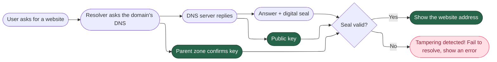
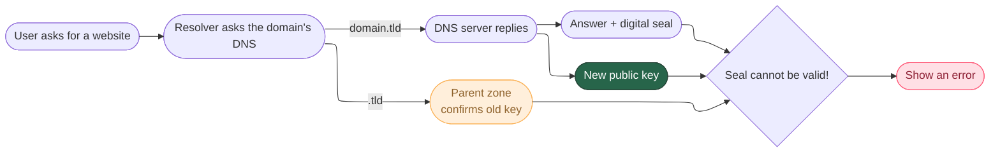
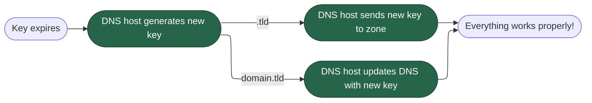
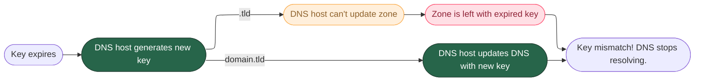

# DNSSEC And You: Let's Do A Learn

---

## What is DNSSEC?

A system to let your machine know that DNS results come from the right place, and haven't been tampered with.

It provides resilience against domain takeover, failing to resolve if shenanigans are detected.

---

## Where does the key come from?

We need to generate a key with a lifetime, which we will use to cryptographically sign DNS results.

That lifetime is usually a few months; 1-3 months is common.

---

## How does DNSSEC fail?

Since two bodies have to know the key, it can get out of sync.

---

## The two scenarios

We now need to consider:

1. DNS host is the same as domain registrar
2. DNS host is a different company than domain registrar

---

### Scenario 1: Registrar and DNS host are the same

When your domain registrar is also your DNS host, they can make sure the keys are kept in sync.

---

### Scenario 2: Registrar and DNS host are the different

When your domain registrar and DNS host are separate, each one can't coordinate with the other.

---

## So how does it ever work for different companies?

Simple. **You are responsible for manually updating the key**.

You have to do this depending on the lifetime of the key.

---

## What if I forget to update the key?

If you forget to update the key, or there's some sort of organisational clusterfuck, **your DNS will stop resolving** until it's fixed.

This means your website will be unreachable, your email to that domain will stop working, and any other services relying on your domain name will be affected.

**That's bad**.

---

## Recommendation

Use the same company for domain registration and DNS.

Since we're using Cloudflare for Workers too, having that tight integration means everything can be managed in one place.

Consider that **you rarely log in to your registrar** if it's a different company.

---

## Caveats

Cloudflare has one restriction: **you can't point your domain's nameservers to anyone but Cloudflare.**

---

## Does that impact us?

In a word, no.

In two words, still no.

While the DNS has to be on Cloudflare, you can still point records anywhere you like.

---

## Keeping an eye on it

Regardless of our choice, we should implement monitoring for DNSSEC validity. I'm working on that; I'm trying to find a cheap or even free solution.

---

## Questions?

I hear people add this slide to their presentations a lot.

---

## License

[MIT License](LICENSE)
